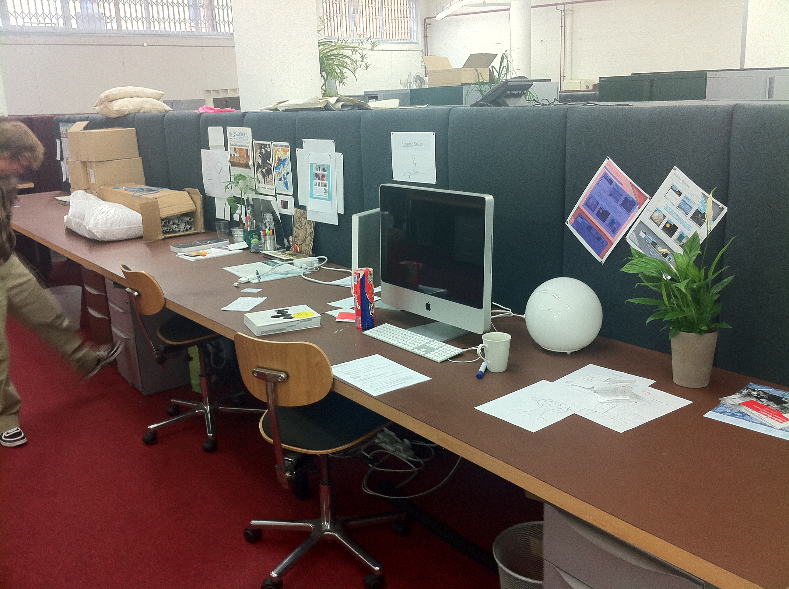
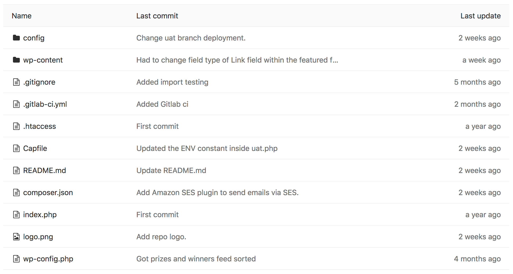

footer: A modern WordPress development workflow - David Darke | [atomicsmash.co.uk](https://www.atomicsmash.co.uk)
slidenumbers: true

# A modern WordPress development workflow

---

---

## 8 years ago

---

## Today

---

### Working on WordPress

---

[.build-lists: true]

# [fit] What's wrong with this?

* Almost impossible for two developer to work at the same time
* Dropbox does have a revision system, but only on a per file basis
 * No real history
 * No way of restoring a
* Deployments were cumbersome and not traceable
* No real control over servers and hosting
* Nothing was re-usable

---

[.build-lists: true]

## X challenges

#

* Shared development environment
* Get a reliable deployment method
* Improve hosting

---

---

# [fit] Our shared development environment

---

### The anatomy of 99.9999% of WordPress Websites

#### What makes any WordPress site unique?

---

### Think of your Wordpress website as a web application.
### It's just a dependancy

---

## Your theme and custom plugin code

### Get your code into GIT... NOW

---

### 'Please use git' - A blog by Amin Shah Gilani [^1]

* It’s too complicated
* I’m not too good with the command line.
* “Our project is too small”
* “Our team is too small”
* “We use Dropbox”

---

---

## We started using shared remote databases
##  **mysql.mycompany.co.uk**

This means all our **development** databases are accessible from anywhere.

---

### Think of your Wordpress website as a web application.

You shouldn't need live content to build / test a website

---

# GDPR

If you are downloading content to a development machine from a live site, make sure you aren't pulling live user / customer data.

---

# Recap 2

#ASTODO make this the second version of the diagram

---

## We store development asset on Amazon S3

An S3 bucket per site, which is only accessible to the development team

---

# Recap 3

#ASTODO Only show WordPress parts

---

---

# [fit] THANKS! ☺️

Follow me:
@david_darke

Follow my studio:
@atomicsmash

Get presentation here:
https://github.com/daviddarke/A-modern-WordPress-development-workflow

---

# [fit] Any questions? 🙋 🙋‍♂️

[^1]: https://hackernoon.com/please-use-git-da3bea7d1234
