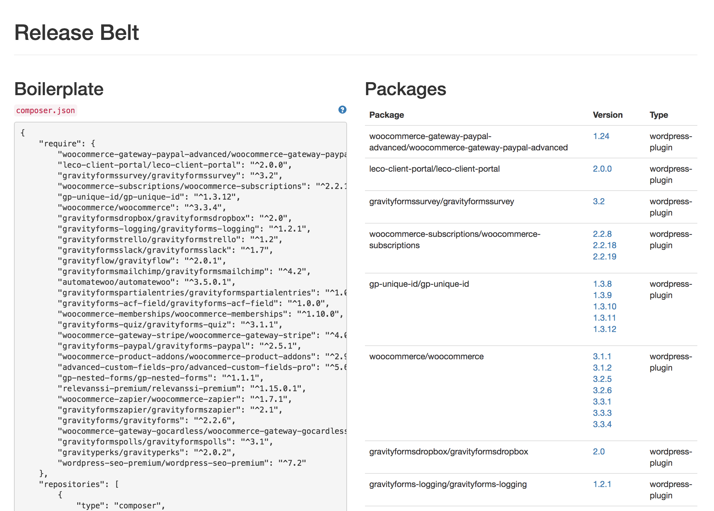
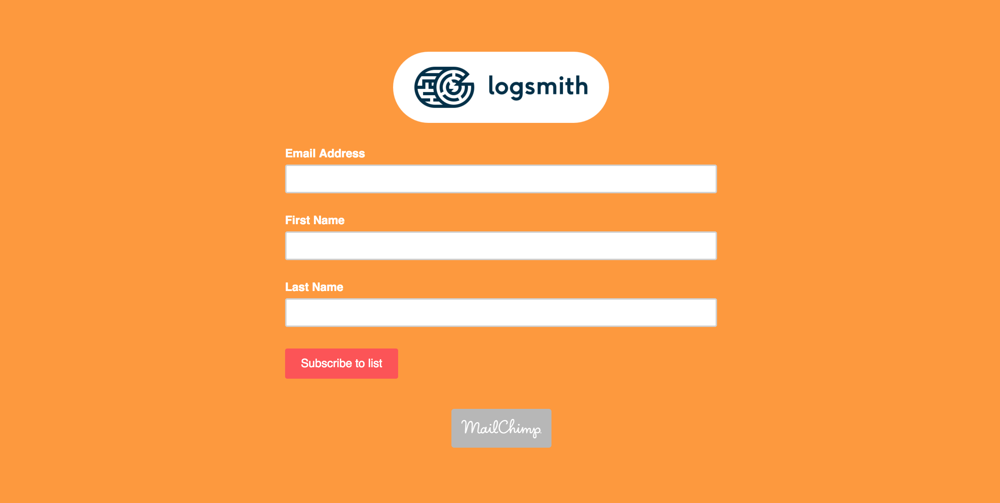

footer: A modern WordPress development workflow - David Darke | [atomicsmash.co.uk](https://www.atomicsmash.co.uk)
slidenumbers: true

# A modern WordPress development workflow

---

---

## September 2010

---

## Today (April 2018)

---

### Working with WordPress

---

[.build-lists: true]
[.autoscale: true]

# [fit] What's wrong with this?

* It's almost impossible for two developer to work at the same time, (unless they are sat next to each other)
* Dropbox does have a revision system, but only on a per file basis
* Deployments were cumbersome and not traceable (FTP is the worst)
* No real control over servers and hosting (Shared hosting)
* Nothing was re-usable
* Hours wasted handling development environment differences and thing out of our control

---

## Our challenges

* Shared development environment (reproducible)
* Find a reliable deployment method
* Improve hosting reliability, level of control and performance

---

---

# [fit] First, how do
# [fit] we run WordPress sites
# [fit] on our local machines?

---

### Laravel Homestead

---

---

### Laravel Homestead

> **Laravel Homestead is an official, pre-packaged Vagrant box that provides you a wonderful development environment without requiring you to install PHP, a web server, and any other server software on your local machine.**
-- Homestead documentation

^ Vagrant boxes are completely disposable. If something goes wrong, you can destroy and re-create the box in minutes!

---

### The anatomy of 99.9999% of WordPress Websites

#### What makes any WordPress site unique?

---

### Think of your Wordpress website as a web application.
### It's just a dependancy

---

## Your theme and custom plugin code

### Get your code into GIT... NOW

---
[.autoscale: true]

### 'Please use git' - A blog by Amin Shah Gilani [^1]

* It’s too complicated
* I’m not too good with the command line.
* “Our project is too small”
* “Our team is too small”
* “We use Dropbox”

---

# Recap 3

#ASTODO Only show database part

---

## We started using shared remote databases
##  **mysql.mycompany.co.uk**

This means all our **development** databases are accessible from anywhere.

---

### Think of your Wordpress website as a web application.

You shouldn't need live content to build / test a website

---

# GDPR

If you are downloading content to a development machine from a live site, make sure you aren't pulling live user / customer data.

---

# Recap 2

#ASTODO make this the second version of the diagram

---

## We store development asset on Amazon S3

An S3 bucket per site, which is only accessible to the development team

---

# Recap 3

#ASTODO Only show WordPress parts

---

We need a way of getting WordPress

---

Composer pulls which even WordPress version is required (usually the latest) and all required plugins.
# [fit] https://www.atomicsmash.co.uk/blog/using-composer-wordpress-development/

---

# Premium plugins

We use an private composer storage solution called Release Belt.

https://github.com/Rarst/release-belt

---

---

# Signup for logsmith

We are looking for beta testers

http://eepurl.com/dkjmHb

---

---

---

# THANKS!

Follow me:
@david_darke

Follow my studio:
@atomicsmash

Get presentation here:
https://github.com/daviddarke/A-modern-WordPress-development-workflow

---
[.autoscale: true]

### Tool list

- Capistrano | Used to deploy code from GIT to servers.
- Composer | Used to pulling PHP dependancies like Wordpress.
- Forge | Used for provisioning servers
- GIT | A version control system for storing and sharing code.
- Logflume | Gets uploads onto S3 so they are sharable with other developers
- Logsmith | The development framework made by Atomic Smash
- Release belt | Used for storing premium plugins and making them privately accessible to composer.

---

# [fit] Any questions? 🙋 🙋‍♂️

[^1]: https://hackernoon.com/please-use-git-da3bea7d1234
