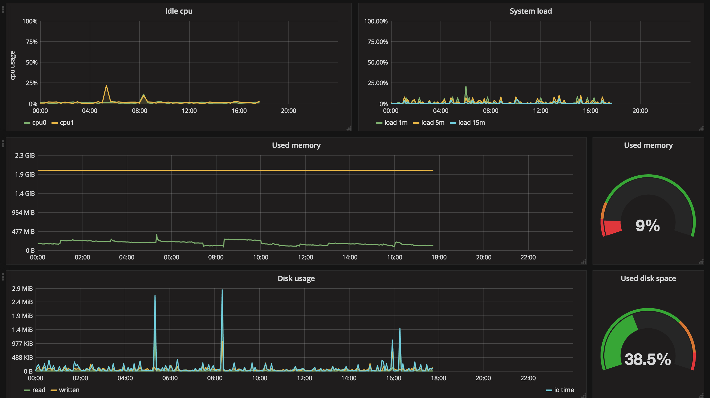

footer: A modern WordPress development workflow - David Darke | [atomicsmash.co.uk](https://www.atomicsmash.co.uk)
slidenumbers: true

# [fit] A modern WordPress
# [fit] development workflow
## By David Darke

---

---

## September 2010

---

---

[.build-lists: true]
[.autoscale: true]

# [fit] What's wrong with this simple setup?

* It's almost impossible for two developer to work at the same time, (unless they are sat next to each other)
* Dropbox does have a revision system, but only on a per file basis
* Deployments were cumbersome and not traceable (FTP is the worst)
* No real control over servers and hosting (Shared hosting)
* Nothing was re-usable
* Hours (maybe days) wasted handling development environment differences and things out of our control

---

## Today (April 2018)

---

## Our challenges

* **Get a shared development environment** - Hoping to increase development team
* **Improve frontend workflow** - Stop editing flat CSS files
* **Find a reliable deployment method** - Stop f***ing about with FTP
* **Improve hosting reliability** - Increase level of control and performance
* **A future goal of...**

^ Mention the time difference - 7 years

---

## Automated continuous delivery

---

#[fit] Think of your
#[fit] WordPress website,
#[fit] as a **web platform**.

---

### Laravel Homestead

---

### Laravel Homestead

> **Laravel Homestead is an official, pre-packaged Vagrant box that provides you a wonderful development environment without requiring you to install PHP, a web server, and any other server software on your local machine.**
-- Homestead documentation

^ Vagrant boxes are completely disposable. If something goes wrong, you can destroy and re-create the box in minutes!

---

### The anatomy of 99% of WordPress Websites

---

### Your theme code

---

---

#[fit] Get your custom code into GIT...

---

#[fit] Get your custom code into GIT...
#[fit] NOW!!!

---
[.autoscale: true]

### 'Please use git' - A post by Amin Shah Gilani [^1]

* It’s too complicated
* I’m not too good with the command line.
* “Our project is too small”
* “Our team is too small”
* “We use Dropbox”

^
* Deployment uses it
* Project tracking uses it
* Everyone uses it

---

---
[.autoscale: true]

## We use **shared** remote databases
##  **mysql.mycompany.co.uk**

This means all our **development** databases are accessible from anywhere.

- No syncing
- Content is shared between developers
- Wordpress locking stops two people editing the same content at the same time

---

---

## We store development uploads on Amazon S3

An S3 bucket per site, which is only accessible to the development team

---

---

Composer pulls a WordPress version (usually the latest) and all required plugins. [^2]

---

Git repository doesn't include WordPress, plugins or uploads

---

## Our challenges

* ~~Get a shared development environment~~ ✔
* Improve frontend workflow
* Find a reliable deployment method
* Improve hosting reliability

---

---

More about frontend tools [^3]

---

## Our challenges

* ~~Get a shared development environment~~ ✔
* ~~Improve frontend workflow~~ ✔
* Find a reliable deployment method
* Improve hosting reliability

---

# Capistrano

---

## A single deployment

1. **Developer** runs `cap production deploy`
1. **Capistrano** logs into your remote server
1. **Capistrano** grabs the latest code from Git
1. **Capistrano** runs composer and pulls down WordPress
1. If there are no errors in setup, **Capistrano** puts changes live

---

## `cap production deploy`
## `cap uat deploy`
## `cap staging deploy`

---

## `cap production deploy:rollback`

---

## Our challenges

* ~~Get a shared development environment~~ ✔
* ~~Improve frontend workflow~~ ✔
* ~~Find a reliable deployment method~~ ✔
* Improve hosting reliability

---

# [fit] The hosting company

---

# [fit] Hosting provisioning

---

# Forge...

1. It creates the server on Digital Ocean
1. Installs Nginx, PHP, MySQL + a bunch of other stuff
1. Helps automate FREE Let's Encrypt SSLs (and normal SSLs)
1. Provides an interface for creating 'sites'
1. Provides an interface for creating databases
1. Patches the servers for security updates (in the background)
1. Admin still has full control over the server

^ It's not a hosting cpanel

---

### Old dev process

---

---

### New dev process

---

---

## Premium plugins with composer

We use an private composer storage solution called Release Belt.

https://github.com/Rarst/release-belt

---

---

## Server metrics via Prometheus

---

---

---

#[fit] BONUS!

---

---

---

#[fit] Signup for logsmith

#[fit] We are looking for beta testers

#[fit] **http://eepurl.com/dkjmHb**

---

---

# THANKS!

Follow me:
@david_darke

Follow my studio:
@atomicsmash

Get presentation here:
https://github.com/daviddarke/A-modern-WordPress-development-workflow

---
[.autoscale: true]

### Tool list

- Capistrano | Used to deploy code from GIT to servers.
- Composer | Used to pulling PHP dependancies like Wordpress.
- Forge | Used for provisioning servers
- GIT | A version control system for storing and sharing code.
- Logflume | Gets uploads onto S3 so they are sharable with other developers
- Logsmith | The development framework made by Atomic Smash
- Release belt | Used for storing premium plugins and making them privately accessible to composer.

[^1]: https://hackernoon.com/please-use-git-da3bea7d1234

[^2]: https://www.atomicsmash.co.uk/blog/using-composer-wordpress-development/

[^3]: https://www.atomicsmash.co.uk/blog/our-current-development-tools-and-workflows/
